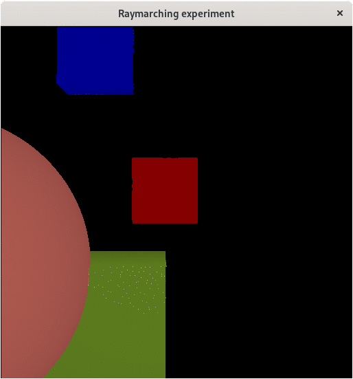

# Raymarching example
Simple 3D renderer using raymarching principles.



Screen recording sped up and loq quality due to gif size issues

## Running
On project's root directory type:

```bash
julia --project=. src/main.jl   
```

## Instructions
Use W, A, S, D to move.
